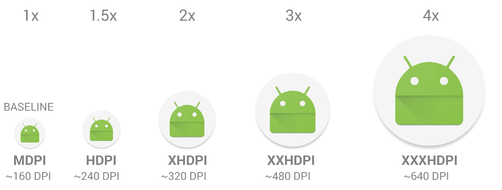

[Kezdőlap](../README.md)

# Android

## 1. Fejlesztőkörnyezet, SDK Manager, AVD Manager. Fizikai eszközön való futtatás megvalósítása.

**Fejlesztőkörnyezet:**
Android fejlesztés hivatalos fejlesztőkörnyezete az Android Studio, amely egy IntelliJ alapú IDE. 
Számos hasznos funkciót biztosít a hatékony fejlesztés érdekében:
* Grade-alapú fordítás támogatása
* Emulátorok létrehozása
* Instant run funkció: megváltozott kód futtatása új apk létrehozása nélkül
* Mintakódok és projektsablonok
* Git integráció
* Tesztelési funkciók
* Teljesítménymérő eszközök
* C++, Android NDK támogatás
* Google felhőszolgáltások integrációjának elősegítése
* Database Inspector: Emulátoron vagy fizikai eszközön futtatott alkalmazás SQLite adatbázisának kezelése

A fejlesztőkörnyezet telepítése előtt az Oracle Java (Java SE Development Kit) SDK telepítése szükséges.
Az Android Studio Windows, Mac, Linux és Chrome OS operációs rendszerekre egyaránt elérhető.

*Felhasználói felület*
Minden projekt Android Studio-ban egy vagy több modulból áll, mely forrás- és erőforrásállományokat tartalmaznak.
Alapértelemezett az Andoid nézet, ami projektünket alkalmazásra (app) és gradle script-ekre bontva láthatjuk.
app-on belül további három könyvtárra választja szét az alkalmazást:
* manifests: alkalmazás manifest állománya (AndroidManifest.xml), amely az engedélyeket, komponenseket, stb. definiálja
* java: forrásállományok helye, beleértve a teszteket is
* res: erőforrásállományok (minden, ami nem forrásállomány) helye: XML layout, szövegek, képek, animációk, hangfájlok, stb.

*Kódkiegészítés és navigáció*
A kódkiegészítés minden fejlesztőeszköz kiemelkedően fontos funkciója, amely a programkód megírását gyorsítja.
Az eszköz által javasolt módosítások segítségével jobb minőségű forráskódot tudunk létrehozni,
egységesebb kódbázist kaphatunk és megismerkedhetünk új megoldásokkal is.
Android Studio-ban ennek három szintje létezik, ezeket billentyűkombinációkon keresztül érhetjük el:
* Basic completion (Control + Space): Alapvető javaslatokat tesz változók, típusok, metódusok, kifejezések kiegészítése.
* Smart completion (Control + Shift + Space): Kód környezetétől függően tesz pontosabb javaslatokat.
* Statement completion (Control + Shift + Enter): Aktuális kifejezés kiegészítése (hiányzó zárójelek, formázás, stb.).

Gyors funkciók közül kiemelendő még az Alt + Enter kombináció, amivel javítási javaslatokat tesz.
Ilyenek lehetnek például a hiányzó import-ok, interface metódusainak implementálása, stb.
Az Android Studio ezeket a javítanivalókat maga is jelzi a code editor bal oldali sávjában a kódsorok számozása mellett.

**SDK Manager:**
Android Studio telepítése után is van lehetőségünk az új Android verziókat és fejlesztési eszközöket letölteni és azokkal új alkalmazásokat létrehozni, meglévőket pedig frissíteni.
Az SDK Manager ablakában (vagy az sdkmanager parancssori tool-lal) megtekinthetjük a letölthető Android verziókat (SDK Platforms) és SDK eszközöket. 
Az elkészült alkalmazásunkat korábbi Android verziójú rendszereken tesztelhetjük, így biztosítva azt, hogy a lehető legtöbb készüléken működjön az alkalmazásunk.

**AVD Manager:**
Android alkalmazások futtatásához egy fizikai vagy virtuális eszközre lesz szükségünk. 
Virtualizációs megoldásnál jóval több lehetőségünk van mivel telefont, tabletet,
viselhető eszközt vagy akár Android-os TV-t is emulálhatunk. Virtuális eszközök létrehozására az AVD Manager szolgál. 
Amikor létrehozunk egy ilyen eszközt egyaránt választhatunk a Google referenciakészülékeiből
és saját magunk is felparaméterhetünk egyet, amely magában foglalja az Android verzióját,
felbontást, memória mennyiségét és a CPU típusát is. Az így létrehozott hardware profilt menthetjük
vagy egy korábbit importálhatunk is az AVD Manager segítségével.

**Fizikai eszközön való futtatás megvalósítása:**
Az alkalmazásunkat fordítás után többféle módon is futtathatjuk fizikai eszközön:
* Az elkészült *apk* fájlt rámásoljuk a készülékre és a készülék beépített fájböngészője segítségével telepítjük.
Ebben az esetben a beállításokban engedélyezni kell az ismeretlen forrásból származó alkalmazások telepítését.
* Az Android Studió *Run* funkciójának használatához a fizikai eszözt egy adatkábel segítségével
a számítógépre kell kötni, és a beállításokban engedélyezni kell a fejlesztői beállításokat.
Ezek után az IDE a fordításkor létrejött apk állományt telepíti a készülékre és el is indítja azt.

## 2. Android komponensek részletezése: Activity, Service, BroadcastReveiver, ContentProvider.

Android rendszeren általában egy alkalmazás egy vagy több komponensből is állhat. 
Mivel a legtöbb alkalmazás rendelkezik felhasználói felülettel, ezért szinte minden applikáció megjelenik az alkalmazásindítóban. 
Itt viszont nem maga az alkalmazás, hanem a telepített alkalmazások komponensei jelennek meg, egy alkalmazás akár több komponense is megjelenhet az alkalmazásindítóban. 
A komponensek közül nem mindegyik érhető el közvetlenül a felhasználó számára, egyes komponensek háttérben futó műveleteket végeznek, vagy különböző események hatására aktiválódnak. 
Négy komponenst különböztetünk meg az Android platformon, ezek mindegyike eltérő funkcionalitással bír:
* Activity
* Service
* ContentProvider
* BroadcastReceiver

**Activity**
Az [Activity](https://developer.android.com/guide/components/activities/intro-activities) komponens felel a felhasználói felület megjelenítéséért, ezért a legtöbb
alkalmazás rendelkezik legalább egy Activity-vel.
Egy alkalmazás több Activity-t is tartalmazhat, és a megfelelő konfigurációval akár több Activity is megjelenhet az alkalmazásindítóban.
Az Activity komponens saját [életciklussal](#5.-Activity-életciklusmodellje.) rendelkezik, amelyben változás bekövetkezhet felhasználó interakció vagy rendszerművelet hatására.
Lehetőség van az alkalmazásban definiált Activity komponenseket más alkalmazások számára elérhetővé tenni, így az egyes komponensek új komponenseket indíthatnak el.
Egy mobilos alkalmazás eltér az asztali alkamazásoktól olyan tekintetben, hogy a felhasználói interakciók nem mindig ugyanazon a helyen kezdődnek.
Például ha az alkalmazásindítóból nyitjuk meg az email appot, akkor egy email listát látunk.
Azonban ha egy közösségi média alkalmazás nyitja meg az email appot, lehet, hogy egyből az email írása képernyő nyílik meg.
Az Activity osztály úgy lett tervezve, hogy megkönnyítse ennek a paradigmának a használatát.

**Service**
A [service](https://developer.android.com/guide/components/services) (szolgáltatás) komponenst háttérben futtatható műveletek elvégzésére használjuk.
A szolgáltatások nem rendelkeznek felhasználói felülettel, és futásuk nem áll le, ha az alkalmazásunk háttérbe kerül.
Hosszan futó műveleteket hajthat végre a háttérben.
Leggyakoribb felhasználásai között van a hálózati kérések lebonyolítása, zenelejátszás, adatszinkronizáció és fájlműveletek elvégzése.
Fontos viszont, hogy a szolgáltatás által futtatott kód a fő (UI) szálon kerül végrehajtásra, így az idő és erőforrás igényes feladatok végrehajtását külön szálon kell megvalósítani.
A szolgáltatások 3 különböző típusát használhatjuk:
* Foreground service, amely a felhasználó számára észrevehető műveletet hajt végre, például zenelejátszás.
Ezen szolgáltatásoknál kötelező egy értesítés megjelenítése, amely mindaddig látszik, amíg a szolgáltatás fut.
* Background service, amely olyan háttérben futó feladatot lát el, amit a felhasználó közvetlenül nem láthat. Pl.: adatszinkronizáció.
Az újabb és újabb Android verziók mind egyre komolyabb megszorításokat vezetnek be, hogy mikor engedik futtatni ezeket a szolgáltatásokat.
* Bound service, amely egy olyan szolgáltatás, amihez egy másik komponens kapcsolódik.
A kapcsolódó komponens lehet másik alkalmazásból is, és a kapcsolódás kommunikációs lehetőséget biztosít a szolgáltatás és a komponens között.
Több komponens is kapcsolódhat egy szolgáltatáshoz, viszont a szolgáltatás leáll, ha már egy komponens sem csatlakozik hozzá.

**ContentProvider**
A [ContentProvider](https://developer.android.com/guide/topics/providers/content-providers) egy tartalomszolgáltató komponens, amely lehetővé teszi az alkalmazások közötti adatmegosztást.
Az tartalomigénylőnek nem kell tudnia milyen adatforrás tartalmazza az adatokat, csak a tartalomszolgáltatót kell ismernie.
Az Android rendszer több tartalomszolgáltatóval is rendelkezik, és ezeken keresztül biztosítja az alkalmazások számára például a névjegyzék, a naptár, vagy a híváslista elérését.

**BroadcastReceiver**
A [BroadcastReceiver](https://developer.android.com/guide/components/broadcasts) egy olyan komponens, amely bizonyos üzenetek hatására aktiválódik.
Működését úgy kell elképzelni, hogy a BroadcastReceiver meghatározza, milyen üzenetek szeretne fogadni, majd egy ilyen üzenet létrejöttekor az Android rendszer megkeresi az összes telepített komponens közül azokat, amelyek fogadhatják az üzenetet.
Például amikor az eszköz bekapcsolt, kapcsolódott a Wifire, vagy megkezdődött az akkumulátor töltése.
Az üzenetek létrejöhetnek valamilyen rendszeresemény hatására, de az alkalmazások is hozhatnak létre saját üzeneteket.
Az üzenet hatására a végrehajtandó műveletet az adott BroadcastReceiver osztály határozza meg.

## 3. Erőforrás-állományok. Manifest állomány.

**Erőforrások**
Az Android platformra való fejlesztésnél alapvető szempont, hogy egy alkalmazás módosítás nélkül képes legyen futni különböző méretű, hardverű és Android verziójú eszközökön.
Ez megoldható lehetne például fordítási variánsok használatával, azonban ekkor minden konfigurációra külön telepítőre lenne szükség, ami egy valós projekt esetében fenntarthatatlan.
A probléma megoldására egy olyan rendszert hoztak létre, amelyben az alkalmazás a futtató hardver és rendszer tulajdonságaitól függően tud különböző elemeket betölteni.
Az alkalmazás ezen „változó” részeit ún. erőforrás-állományoknak hívjuk.
Az erőforrások között találhatóak meg a felhasználói felületek, szövegek, képek és animációk is.
Lehetőség van statikus tartalmak hozzáadására is, viszont a legtöbb erőforrást XML fájlokban definiálhatjuk.
Az erőforrás fájlok a *res* könyvtárban találhatóak, azon belül pedig tartalmuk alapján további mappákra vannak csoportosítva. 
A legfontosabb könyvtárak:

* `anim/` - animációk
* `color/` - színek
* `drawable/` - képek és vektorgrafikus tartalmak
* `mipmap/` - alkalmazás ikon
* `layout/` - felhasználó felületek
* `menu/` - menük
* `raw/` - statikus fájlok
* `values/` - egyszerű értékek:
  | Könyvtár   | Erőforrás típusa  | Példa                                          |
  |------------|-------------------|------------------------------------------------|
  | arrays.xml | erőforrás tömbök  |                                                |
  | styles.xml | stílusok és témák |                                                |
  | colors.xml | szín értékek      | `<color name="white">#FFFFFF</color>`          |
  | dimens.xml | dimenzió értékek  | `<dimen name="padding_size_small">8dp</dimen>` |
  | string.xml | szöveges értékek  | `<string name="ok_button">OK</string>`         |

Ezekben a mappákban található fájlok lesznek az ún. alapértelmezett erőforrások.
Ezek az erőforrások nem rendelkeznek [minősítővel](##-4.-Minősítők,-mértékegységek.), így ha a rendszer nem talál az eszköz és rendszer tulajdonságaihoz megfelelő erőforrást, akkor az alapértelmezettet használja fel.

A rendszer fordítás során minden erőforráshoz egy egyedi azonosítót rendel, majd ezeket az erőforrások típusai szerint különböző osztályokba sorolja.
Minden erőforráshoz generálódik egy static int típusú változó, mely az erőforrás azonosítóját tartalmazza.
Az azonosítókat az *R* osztály tartalmazza, majd ezen belül további osztályok találhatóak az erőforrás típusoknak megfelelően.
A megfelelő erőforrás kiválasztását a rendszer teljesen automatikusan végzi, így a rájuk való hivatkozáskor csak az erőforrás azonosítóját kell megadni.
Az erőforrásokra a következőképpen hivatkozhatunk a kódban vagy az XML fájlokban:

| Kód                 | XML                                |
|---------------------|------------------------------------|
| `R.string.app_name` | `android:label="@string/app_name"` |

Statikus (nem módosítható) fájlok elérésére két lehetőséget biztosít a rendszer.
Ha az adott fájlok tartalmát csak szimplán be szeretnénk tölteni (például hang, videó fájlok) akkor a *raw* könyvtár használata javasolt.
Ha viszont ennél komplexebb megoldásra van szükségünk, akkor érdemes az *assets* könyvtárat használni.
Ebben tetszőlegesen hozhatunk létre könyvtárakat és fájlokat, és a tartalmát az *AssetManager* osztály segítségével tudjuk olvasni.

A lokalizáció megvalósításához fel tudjuk használni az [erőforrás](##-4.-Minősítők,-mértékegységek.) minősítőket.
Ennek megvalósításához viszont feltétlen szükséges, hogy az alkalmazásban a felhasználó számára megjelenő összes szöveg string erőforrásként legyen rögzítve.
Így ha az alkalmazásban található a rendszer nyelvi beállításainak megfelelő minősítővel ellátott erőforrás, akkor azok kerülnek megjelenítésre.
Előfordulhatnak olyan szövegek, amelyeket nem szeretnénk vagy nem szükséges fordítani, ezeket a `<string>` tag-en használható `translatable="false"` tulajdonsággal adhatjuk meg.

| /values/strings.xml                                         | /values-hu/strings.xml                    | /values-de/strings.xml                  |
|-------------------------------------------------------------|-------------------------------------------|-----------------------------------------|
| `<string name="yes_button">Yes</string>`                    | `<string name="yes_button">Igen</string>` | `<string name="yes_button">Ja</string>` |
| `<string name="ok_button" translatable="false">Ok</string>` |                                           |                                         |

**Manifest állomány**
Minden Android alkalmazás vagy könyvtár modulnak elengedhetetlen eleme az *AndroidManifest.xml* állomány, amely információt szolgáltat az alkalmazásról és a benne lévő komponensekről a fordító eszközök, az operációs rendszer és az alkalmazás-áruházak számára.
A végleges állomány a fordítás során készül el, ahol a függőségekben lévő AndroidManifest fájlok tartalma is összefésülésre kerül az alkalmazáshoz tartozó adatokkal.
Végeredményképp egy olyan fájlt kapunk, amely tartalmazza az alkalmazás és az összes függőség komponensét, jogosultságát, és tulajdonságát.
Harmadik féltől származó komponensek használatakor érdemes megnézni, hogy pontosan miket tartalmaz a Manifest állomány.
Előfordulhat, hogy például olyan jogosultságokat kér, amelyek miatt a felhasználók nem telepítik az alkalmazást.
A Manifest fájl gyökér eleme a `<manifest>` tag, melynek tartalmaznia kell az alkalmazás csomagnevét, valamint a verziókódot és verziónevet.
A csomagnév általában megegyezik a projektben használt Java névtérrel, és a package tulajdonsággal állíthatjuk be.
A verziókódot és a verziószámot nem kell külön feltüntetni, a végleges Manifest fájlban a Gradle állítja be a megfelelő értékeket.
Az alkalmazáshoz tartozó tulajdonságok beállítására az `<application>` tagot kell használni, ezen megadhatjuk az alkalmazás nevét (`android:label`), ikonját (`android:icon`) vagy akár a használt témát (`android:theme`).

```
<manifest xmlns:android="http://schemas.android.com/apk/res/android" package="com.example.app">
  <application
    android:icon="@mipmap/ic_launcher"
    android:label="@string/app_name"
    android:roundIcon="@mipmap/ic_launcher_round"
    android:theme="@style/AppTheme">
  </application>
</manifest>
```

Az `<application>` tagon belül kell felsorolni az egyes alkalmazás komponenseket, mégpedig a következő elemekkel:
| Komponens         | XML tag      |
|-------------------|--------------|
| Activity          | `<activity>` |
| Service           | `<service>`  |
| BroadcastReceiver | `<receiver>` |
| ContentProvider   | `<provider>` |

Az operációs rendszer egyes funkcióihoz és bizonyos hardveres eszközök használatához az alkalmazásunknak engedélyekre van szüksége.
Ezek az engedélyek telepítés előtt a felhasználó számára fel vannak tüntetve, valamint az Android 6.0 verziótól kezdve bizonyos jogosultságokat már az alkalmazás futása közben külön jóvá kell hagynia a felhasználónak.
Az Android rendszerben meghatározott jogosultságokon kívül készíthetünk saját jogosultságokat, valamint használhatunk más alkalmazások által létrehozottakat.
Egy jogosultság használatához a `<uses-permission>`, létrehozáshoz pedig a `<permission>` tagot használhatjuk.

```
<manifest>
   <uses-permission android:name="android.permission.CAMERA" />
   <uses-permission android:name="android.permission.INTERNET" />
</manifest>
```

A példában megadott szabályok alapján az alkalmazás nem lesz telepíthető olyan eszközökre, amelyek nem rendelkeznek Bluetooth hardverrel. Az alkalmazás viszont rendelkezik olyan funkciókkal, amelyek a kamerát is használatba vennék, viszont megléte nem feltétlen szükséges az alkalmazás használatához.

## 4. Minősítők, mértékegységek.

Mivel az Android-os eszközök több különböző felbontásban és képernyőméretetben jelennek meg, az alkalmazásunknak is támogatnia kell ezeknek a készülékeknek legalább egy részhalmazát.
A támogatott megjelenítéseket úgy érdemes kiválasztani, hogy a lehető legtöbb felhasználót érjük el.
Annak érdekében, hogy tovább tudjunk lépni, tekintsük meg az alábbi fogalmakat:
* Képernyőméret: Eszköz fizikai képátlóját jelenti. Értékei: small, normal, large, extra large.
* Képernyősűrűség: Pixelek száma egy adott fizikai területen (általában dpi-ben, azaz dots per inch-ben). Értékei: low, medium, high és extra high
* Orientáció: Eszköz elhelyezkedése lehet álló (portait) vagy fekvő (landscape), amely orientáció futási időben is megváltozhat.
* Felbontás: A képernyőn található fizikai pixelek száma. A felület létrehozásában a felbontás helyett a képernyőmérettel és a pixelsűrűséggel dolgozunk.

**Mértékegységek**
Nem csak az Androidos eszközök képernyőinek mérete, de a felbontása is eltérhet, vagyik míg az egyik eszköz 160 DPI (dots per inch) pontsűrűségű, addig egy másik eszköz lehet 480 DPI.
Ha nem vesszük figyelembe az eszközök ezen tulajdonságait, akkor a rendszer például átméretezheti a képet, ami homályos lesz, vagy a kép teljesen rossz méretben jelenik meg.
Ezek elkerülése érdekében érdemes bevezetni két mértékegységet:
* sűrűségfüggetlen pixel: dp (density-independent pixels)
* skálafüggetlen pixel: sp (scale-independent pixels)

Android természetesen támogat más mértékegységeket is, a vezérlők méretét például pixelben (px), inch-ben (in), milliméterben (mm) vagy pontban (pt) is megadhatjuk.
A sűrűségfüggetlen mértékegységek abban nyújtanak segítséget, hogy a különböző felbontású készülékeken egységes méretben jelenjenek meg a vezérlők.
Szövegmegjelenítésnél használatos a skálafüggetlen pixel (sp), ami azért fontos, mert a felhasználó az Android készülék beállításainál megváltoztatja a betűméretet, így az alkalmazásunkon belül is a szövegek mérete ez alapján fog változni.
Összegezve az előbbieket, vezérlők méreténél, margin és padding tulajdonságnál a dp-t, szövegméreteknél pedig az sp-t használjuk.

**Minősítők**
Annak érdekében, hogy egy alkalmazás módosítás nélkül képes legyen futni különböző méretű, hardverű és Android verziójú eszközökön, erőforrásminősítőket kell használnunk.
Egy erőforráshoz több minősítőt is megadhatunk, ilyenkor a használathoz minden feltételnek meg kell felelnie.
A minősítők kezelését a rendszer a mappák elnevezéseivel oldja meg, mégpedig a következőképpen:

| Könyvtár neve     | Elérési út              | Minősítők   | Jelentése                                  |
|-------------------|-------------------------|-------------|--------------------------------------------|
| layout            | /res/layout/            | -           | "default" kinézet                          |
| layout-large      | /res/layout-large/      | large       | kinézet nagy képernyőkre                   |
| layout-large-land | /res/layout-large-land/ | large, land | kinézet nagy képernyőkre, fekvő helyzetben |

A `layout/` könyvtárban elhelyezett felületek támogatják a portait és a landscape nézeteket egyaránt.
Képernyőméretekhez is tartoznak minősítők, a fogalmaknál felsorolt képernyőméret azonosítók az alábbiak:
* xlarge: legalább 960dp x 720dp
* large: legalább 640dp x 480dp
* normal: legalább 470dp x 320dp
* small: legalább 426dp x 320dp

Az így létrehozott mappákban az adott erőforrásnak ugyanazzal a fájlnévvel kell szerepelnie, a rendszer innen tudja, hogy több változat is elérhető.
A minősítők felsorolásánál a sorrend kötött, tehát rossz sorrend alkalmazása esetén az adott erőforrás nem lesz figyelembe véve.
A rendszer futásidőben választja ki a megfelelő erőforrást az alapján, hogy milyen eszközön fut.

Ahhoz, hogy a grafikai elemek jól jelenjenek meg minden méretű és felbontású eszközön, 2 lehetőségünk van:
* Használjunk vektorgrafikus grafikai elemeket
* Raszteres grafikai elemek esetén biztosítsuk több verziót az adott elemből, egyet-egyet minden sűrűség-tartományhoz, megfelelő felbontással, a megfelelő mappába elhelyezve (`drawable/mdpi`, `drawable/hdpi`, `drawable/xhdpi`, stb). A rendszer a minősítő alapján fogja eldönteni, hogy az adott eszközön melyik verziót töltse be.



A lokalizáció megvalósításához is fel tudjuk használni az erőforrás minősítőket.
Ennek megvalósításához viszont feltétlen szükséges, hogy az alkalmazásban a felhasználó számára megjelenő összes szöveg string erőforrásként legyen rögzítve.
Így ha az alkalmazásban található a rendszer nyelvi beállításainak megfelelő minősítővel ellátott erőforrás, akkor azok kerülnek megjelenítésre.
Előfordulhatnak olyan szövegek, amelyeket nem szeretnénk vagy nem szükséges fordítani, ezeket a `<string>` tag-en használható `translatable="false"` tulajdonsággal adhatjuk meg.

| /values/strings.xml                                         | /values-hu/strings.xml                    | /values-de/strings.xml                  |
|-------------------------------------------------------------|-------------------------------------------|-----------------------------------------|
| `<string name="yes_button">Yes</string>`                    | `<string name="yes_button">Igen</string>` | `<string name="yes_button">Ja</string>` |
| `<string name="ok_button" translatable="false">Ok</string>` |                                           |                                         |

A rendszer először megpróbálja megtalálni a megfelelő erőforrásminősítővel rendelkező erőforrást.
Ha ezek egyike sem felel meg, akkor az alapértelmezett erőforrásokat használja a megfelelő mappából:
`layout/`, `drawable/`, `values/`, stb.
Az Android Studio IDE segítségével az erőforrások és azok minősítői könnyedén kezelhetőek.

## 5. Activity életciklusmodellje.

Minden felülettel rendelkező alkalmazásnak tartalmaznia kell legalább egy Activity osztályt.
Ezek a komponensek felelnek a felhasználói interakciók fogadásáért valamint a felületek megjelenítéséért. 
Az Activity komponens saját életciklussal rendelkezik, amelyben változás bekövetkezhet felhasználó interakció vagy rendszerművelet hatására.

Az alkalmazások használata során az Activity példányok különböző állapotokon mennek keresztül, például amikor egy alkalmazás előtérbe, vagy éppen megsemmisítésre kerül.
Ha egy új Activity-t indítunk el, akkor az éppen előtérben lévő szüneteltetésre kerül, majd ha újra előtérbe került, akkor működése folytatódik.
Amíg az Activity példány szüneteltetett állapotban van, addig nagyobb esély van rá, hogy a rendszer erőforrás felszabadítás céljából leállítsa azt.

Az Activity példányok létrehozásáért és leállításáért az Android rendszer felel, viszont minden új állapotba lépéskor a rendszer meghívja az állapothoz tartozó úgynevezett „callback” függvényt.
Ezen függvények felüldefiniálásával tudunk az egyes eseményekre reagálni, például ezekben szükséges elvégezni a használt erőforrások felszabadítását vagy az Activity aktuális állapotának mentését.
Tehát ezeken a függvényeken keresztül határozzuk meg azt, hogyan viselkedjen az Activity példányunk, ha életciklusában változás történik.
Ezeket az állapot változásokat nem csak a felhasználó válthatja ki, például egy telefonhívás hatására az éppen futó Activity szüneteltetésre kerül, majd a hívás befejezése után működése folytatódik.
Ilyenkor nem garantált, hogy a felhasználó a hívás után visszatér az alkalmazásunkba, viszont a jó felhasználói élmény érdekében biztosítanunk kell, hogyha visszatér, akkor az alkalmazás állapotát pontosan olyanra állítsuk vissza, mint amikor elhagyta az alkalmazást.
Tehát biztosítanunk kell, ha valaki például egy üzenet vagy SMS írása közben hívást kap, és fogadja azt, a hívás befejezésével ne vesszen el az addig már begépelt üzenete.
Ez elsőre egyszerűnek tűnik, hiszen a hívás idejére az Activity osztályunk működése szüneteltetésre kerül, majd a hívás befejezése után folytatódik.
Viszont előfordulhat az, hogy a készülék akkumulátora merülni kezd, és a rendszer a hosszabb üzemidő elérésének érdekében visszafogja a teljesítményt, amihez a háttérben lévő alkalmazások futását leállítja.
Az ilyen esetek kezelésére mindenképpen szükséges az aktuális állapot mentése, majd visszaállítása.

A következő ábrán láthatjuk egy Activity példány életciklusát, és az állapotváltozások során meghívott „callback” függvényeket.


**onCreate()**
Ez az első „callback” függvény, ami az Activity létrehozásakor kerül meghívásra, itt a *Created* állapotba lép.
A komponens életciklusa során pontosan csak egyszer kerül ebbe az állapotba, és ilyenkor kell a megjelenítendő felületet beállítani (`setContentView()`), vagy akár egy ViewModel-t hozzárendelni az Acitivity példányunkhoz.
Továbbá ha szükségünk van a felhasználói felületet alkotó komponensek referenciáira, akkor azok beállítását is itt kell megtenni, a jól ismert `findViewById()` metódussal.
A függvény egy *Bundle* típusú paraméterrel rendelkezik, amely az Activity legutóbbi mentett állapotát tartalmazza, ha van ilyen.
Activity állapotának mentését az `onSaveInstanceState()` metódus felüldefiniálásával lehet megtenni.
A metódus befejeztével az `onStart()` függvény kerül meghívásra.

**onStart()**
A Created állapot után az Activity a *Started* állapotra vált, és megjelenítésre kerül a felület a felhasználó számára.
Az alkalmazás előkészíti az Activity példányt az előtérbe lépésre, valamint a felhasználói interakciók kezelésére.
A metódus befejeztével az `onResume()` függvény kerül meghívásra.

**onResume()**
Amikor az Activity előtérbe kerül, a rendszer meghívja az `onResume()` metódust.
Fontos kiemelni, hogy az Activity többféleképpen kerülhet ebbe az állapotba, hiszen ha az Activity szüneteltetett állapot után újra előtérbe kerül, akkor is felveszi ezt az állapotot.
Az Activity egészen addig ebben az állapotban marad, amíg előtérben van, viszont külső események hatására ez megváltozhat, mint például egy telefonhívás fogadása, vagy az eszköz kijelzőjének kikapcsolása.
Ilyen események során az Activity *Paused* állapotba lép, majd az esemény befejeztével újra *Resumed* állapotra vált.
Ez a két állapot szoros összefüggésben vagy egymással, mert minden olyan erőforrást, amit *Resumed* állapotba lépéskor kezdünk el használni, azt a *Paused* állapotban kell felszabadítani.
Ezek alapján feltételezhetnénk azt is, hogy az alkalmazás felülete csak akkor látható a felhasználó számára, amikor az *Resumed* állapotban van.
Vannak viszont kivételes esetek, mint például a több ablakos mód.
Ebben az esetben az Activity továbbra is látható marad, viszont *Paused* állapotba kerül.
Ha olyan tartalmat jelenítünk meg, amelynek frissítése ilyen helyzetben is szükséges lehet (pl.: videó lejátszás, kamerakép mutatása), akkor a *Started* és *Stopped* állapotot szükséges használni.

**onPause()**
Ha valamilyen esemény hatására az Activity háttérbe kerül, akkor ez az első metódus, amely meghívásra kerül.
Ebben az állapotban az Activity még mindig látható a felhasználó számára, viszont egy másik Activity került előtérbe.
Ez lehet több ablakos módban egy másik Activity-re váltás, vagy egy nem teljes képernyőt kitöltő Activity előtérbe kerülésének eredménye.
Az esemény lefutása nagyon rövid, ami általában nem elegendő az aktuális állapot mentéséhez, hálózati kérések vagy adatbázis tranzakciók futtatásához.
Az ilyen műveletek elvégzéséhez az `onStop()` metódus biztosít lehetőséget.
A metódus befejeztével az Activity továbbra is *Paused* állapotban marad mindaddig, amíg nem kerül újra előtérbe vagy nem tűnik el teljesen a képernyőről.

**onStop()**
Az Activity `Stopped` állapotba kerül, amikor teljesen eltűnik a képernyőről, vagyis a felhasználó számára nem lesz látható.
Ebben az állapotban érdemes elvégezni az erőforrásigényes műveleteket, amelyek az aktuális állapot mentéséért felelnek.
Az Activity továbbra is a memóriában marad, valamint a megjelenített nézetek állapotai is mentésre kerülnek, így azok tulajdonságainak, adatainak mentésére külön nincsen szükség.
Ha az Activity újra megjelenítésre kerül, akkor a rendszer meghívja az `onRestart()` metódust, vagy befejezése esetén az `onDestroy()` metódust.

**onRestart()**
Ha az Activity *Stopped* állapotban van, és a felhasználó újra az Activity-re navigál, akkor mielőtt az *Started* állapotba lépne, meghívásra kerül az `onRestart()` metódus.

**onDestroy()**
Az Activity megszűntetése előtti utolsó „callback” metódus, amely bekövetkezhet az Activity befejezése, bezárása vagy akár egy orientáció változás hatására.
Ezen a ponton az Activity által birtokolt minden erőforrást fel kell szabadítani, ha ez még nem történt meg az előző állapotokban.

## 6. Felület létrehozása. Vezérlőelemek. View. Felugró értesítések.
Mielőtt a felhasználói felület megvalósításának nekilátnánk, meg kell terveznünk milyen oldalakat jelenítünk meg, hány darab felületből áll az alkalmazásunk, milyen vezérlőelemek kerülnek felhasználásra, az egyes oldalak között milyen kapcsolat lesz, azaz egyik felületről hogyan tudunk egy másikra navigálni.
Alkalmazásunk tervezési fázisában lehetőségünk van online vagy offline eszközöket igénybe venni (vagy akár papíron is), így elősegítve azt, hogy amikor már az Android Studio layout designer-éhez nyúlunk, már egy kész felülettervet kelljen megvalósítanunk.
Ezek a szoftverek általános vezérlőelemeken túl biztosítanak Android, iOS specifikus vezérlőket és témákat egyaránt.

**Vezérlők**
A vezérlők olyan felületi elemeket jelölnek, amelyek a felhasználó számára valamilyen információt jelenítenek meg, vagy információt kérnek be tőle (pl. szövegbeviteli mező) esetleg valamilyen eseményre (érintés vagy más gesztusok) tudnak reagálni.

**View**
Felületen elhelyezhető elemek őse a View osztály, amely egy téglalapnyi terület kirajzolásáért, és azon belül az események kezeléséért felelős.
Minden UI vezérlőelem (widget) tőle származik (Button, TextView, EditText, stb.), ezért megkapják a tulajdonságait és viselkedéseit. 
A View egyik legfontosabb leszármazottja a ViewGroup, minden layout ősosztályja.
A layout-oknak nevezzük azokat a speciális vezérlőket, melyek segítenek a más vezérlők elrendezésében a felületen az általuk definiált rendezési elv szerint.
Egy ViewGroup típusú elem több View-t vagy akár további ViewGroup elemet tartalmazhat.

View tulajdonsági közül az egyik legfontosabb az azonosító (`id`). Minden vezérlőelemhez rendelhetünk egy egyedi azonosítót, ami abban segít, hogy programozott módon (Java kódból) elérjük őket és valamilyen tulajdonságát futásidőben megváltoztassuk (pl.: kiírt szöveg módosítása).
Azonosítót nem minden esetben kell használnunk.
Egy statikus szövegmegjelenítésnél felelős vezérlőnél, amely tartalma sosem változik alkalmazásunk életciklusa alatt, nem feltétlen indokolt beállítani.
A vezérlők elrendezési módszerétől függően ez utóbbi esetben is lehet értelme, például ha az egyik vezérlő elhelyezkedését egy másik befolyásolja, így tudunk az adott elemre hivatkozni. (pl. RelativeLayout, ConstraintLayout).
A fejlesztőkörnyezet (Android Studio) automatikusan generál azonosítókat (pl. textView, textView1 és így tovább), ettől függetlenül érdemes beszédes neveket használni, amely alapján más fejlesztő számára is egyértelmű melyik vezérlőt használja. (pl.: usernameTextView, passwordEditText, loginButton)

A View-t reprezentáló téglalap méretét a szélesség és magasság tulajdonságok határozzák meg, melyeket párban kell megadnunk.
Kötelező tulajdonságokról van szó, amennyiben elhagyjuk őket (felületet leíró XML-ben), fordítási hibát fogunk kapni.
Szélesség és magasság XML attribútumai:

* layout_width
* layout_height

View rendelkezik padding és margin tulajdonságokkal is.
Padding a vezérlő méretét befolyásoló tulajdonság, bal oldalt, felül, jobb oldalt és alul növelhetjük az eredeti méretet.
A többi vezérlőtől vagy a szülőelemtől való eltolást (térköz) pedig a margin (négy oldalt külön módosíthatjuk ugyanúgy, mint a padding esetében) tulajdonsággal állíthatjuk be.

A példában a vezérlő szélességét 400dp-re, a magasságát 200dp-re állítjuk. Margin segítségével a bal oldalt és felül 8dp-vel toljuk el a többi elemtől.
```
<View
   android:id="@+id/main_view"
   android:layout_width="400dp" 
   android:layout_height="200dp"/>
   android:layout_marginTop="8dp" 
   android:layout_marginLeft="8dp" />
```

Minden View-tól származó vezérlő képes eseményekre reagálni, amely a vezérlő területén történik.
Leggyakrabban használt ezek közül a „kattintás” esemény, minden View-től származó vezérlőnél fel lehet iratkozni erre az eseményre.

A példában a fenti View elemre hivatkozunk Java kódból.
Először inicializáljuk a vezérlőt a `findViewById` függvény segítségével.
Meg kell valósítanunk a `View.OnClickListener` interface-t, amely során az `onClick` függvényben definiáljuk mi történjen az esemény hatására.
Az így keletkezett példányt a vezérlő `setOnClickListener` függvényének adjuk át paraméterként.
```
final View mainView = findViewById(R.id.main_view);

mainView.setOnClickListener(new View.OnClickListener() {
	@Override
	public void onClick(View v) {
		// TODO do something
	}
});

```

**TextView**
Felhasználói felületen a szövegmegjelenítésért felelős vezérlő.
Két alapvető használatot különböztethetünk meg a TextView-nál:
* Statikus szöveget jelenítünk meg, később nem szeretnénk módosítani
* Programkódból egy esemény hatására (pl. nyomógombra kattintás) megváltozik a megjelenítendő szöveg

Legfontosabb tulajdonsága a *text*, amelyen keresztül a megjelenítendő szöveget beállíthatjuk, illetve programozott módon ki is olvashatjuk.
További említésre méltó tulajdonságai még a szöveg méretét befolyásoló *textSize* (értékét sp, azaz Scale-independent Pixels mértékegységben adjuk meg), a szöveg megjelenítését módosító *textStyle* (értékei: normal, italic, bold) és a szöveg színét meghatározó *textColor*.

**EditText**
Alkalmazásunk működése során a felhasználótól is várhatunk adatokat szöveg formájában,
erre szolgál az EditText vezérlő.
A vezérlő által megjelenített szöveget szintén a text tulajdonsággal íratjuk, olvashatjuk. 
Segítséget is adhatunk a felhasználónak, hogy milyen információt várunk tőle, így akár a formátumra vonatkozóan is adhatunk utasításokat.
Ebben segít a hint, amely egy placeholder szöveg. Amikor a vezérlő megkapja az input fókuszt a hint szövege eltűnik, csak akkor jelenik meg újra, amikor más vezérlő kapja meg a fókuszt.
Lehetőségünk van korlátozni milyen típusú adatot várunk a felhasználótól (*inputType*), értelemszerűen, ha számot várunk el felesleges más karaktert megjeleníteni a billentyűzeten.
Legtöbbet használt inputType értékek: text, number, textEmailAddress, phone.

**Button**
A nyomógomb az egyik leggyakrabban használt vezérlőelem, amely érintés (kattintás)
hatására egy általunk definiált műveletet képes végrehajtani.
Az alkalmazás egyes funkcióit nyomógombok segítségével tudjuk legegyszerűbben a felhasználó számra elérhetővé tenni.
A `Button` vezérlőn egy feliratot helyezhetünk el a *text* tulajdonságával (leírja a megvalósított funkciót, például Mentés).
Lehetőségünk van képeket is megjeleníteni nyomógombon belül, erre egy külön vezérlőt, az ImageButton-t használhatjuk.
Nyomógomb kattintására (megérintésére) egy `View.OnClickListener` interface impementációt kell létrehoznunk és a `Button` `setOnClickListener` függvényének átadnunk.

**ImageView**
Képi erőforrások megjelenítését valósítja meg az `ImageView` vezérlő.
Bitmap és Drawable típusú adatokat képes megjeleníteni, eredeti vagy átméretezett formában.
A megjeleníteni kívánt képi erőforrást az `src` attribútumon keresztül állítjuk be, ilyenkor általában a `res/drawable` könyvtárba elhelyezett képi erőforrásokra szoktunk hivatkozni.

**Felugró értesítések**
**Toast**
Felugró üzenetek, ablakok létrehozására több lehetőségünk is van Android-ban.
Legegyszerűbb formája a `Toast`, amely rövidebb vagy hosszabb ideig felugró üzenetet jelenít meg.
A megjelenítés idejét a `Toast` osztály `makeText` függvényének a harmadik paramétere szabályozza, értékei: 

* Toast.LENGTH_SHORT
* Toast.LENGTH_LONG

Toast létrehozása után a megjelenítést a `show` függvény eredményezi.

```
Toast.makeText(
   context,
   "Toast message",
   Toast.LENGTH_SHORT
).show();
```

**Snackbar**
Üzenetmegjelenítő elem a felhasználói felületen, amely tipikusan valamilyen művelet
eredményéről értesíti a felhasználót.
A felületen alsó részén jelenik meg (nagy méretű képernyőkön a bal oldalon) egy ideig, viszont a felhasználó akár söprés mozdulattal el is tudja tűntetni.
A Toast-tal összehasonlítva egy szebb és a Material design-ba jobban illő megjelenítést kapunk.
Másik fontos tulajdonsága, hogy a szövegmegjelenítésen túl definiálhatunk funkciót is, amit a felhasználó végrehajthat.
Például egy művelet végrehajtása után lehetőséget biztosítunk annak visszavonására is.
```
Snackbar.make(
   contextView,
   "Snackbar message",
   Snackbar.LENGTH_SHORT
).show()
```

**Dialog**
Dialógus ablakokkal információt tudunk megjeleníteni, illetve döntési lehetőséget biztosíthatunk, vagy további adatokat kérhetünk be a felhasználótól.
Nem foglalják el a teljes képernyőt, általában akkor használjuk, ha a felhasználói beavatkozásra van szükség az alkalmazás működéséhez.
Dialógus ablakokból több típus is létezik, ősosztályuk a `Dialog`.
Például:

* AlertDialog: dialógus ablak címmel, nyomógombbal, listás megjelenítéssel vagy akár teljesen testreszabott felülettel
* DatePickerDialog, TimePickerDialog: dátum és idő kiválasztására szolgáló felületek

## 7. Felület létrehozása. Layout management megoldások. ViewGroup.
## 8. Intent felépítése és működése. Implicit és explicit Intent. Activity indítás formái.
## 9. Fragmentek és navigáció megvalósítása.
## 10. Listák létrehozása. Adapter.

### Felhasznált (ajánlott) irodalom:

* [Hivatalos Android fejlesztői oldal - angol](https://developer.android.com/index.html)
* Eszéki Dániel - Bolla Kálmán Milán [Android szoftverfejlesztés](https://oszkdk.oszk.hu/storage/00/03/17/37/dd/1/03_Esz__ki_D__niel_Bolla_K__lm__n_Mil__n_Android_szoftverfejleszt__s.pdf)

[Kezdőlap](../README.md)
